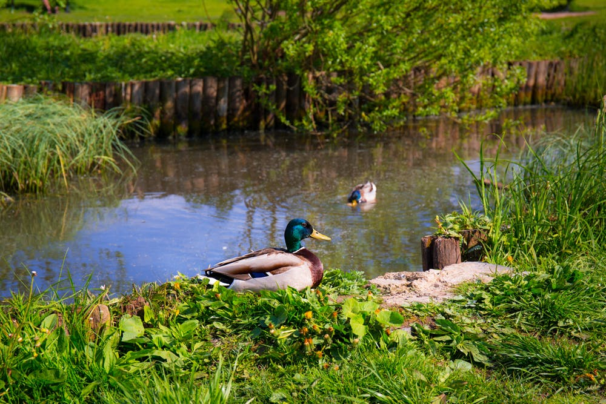

# 204Ducks

The repository for the project 204Ducks



---

## How to launch

```sh
USAGE: ./204ducks a

DESCRIPTION:
a   constant (between 0 and 2.5)
```

Started the unit tests of pytest =>  
pytest  
(Explanation: execute all test_*.py files)  

---

## The purpose of the project

Make probability calculations about ducks in a pond.

When ducks are disturbed by a sudden noise, they fly away almost simultaneously, leaving the pond empty.
Chances that a duck will then come back after t minutes are given by the following probability density
function.

The average time after which ducks come back,  
The standard deviation of the ducks’ return time,  
The time after which 50% of all of the ducks are back,  
The time after which 99% of all of the ducks are back,  
The percentage of ducks that come back after 1 minute,  
The percentage of ducks that come back after 2 minutes.  

---

## People on the project

| [<br><sub>Pierre-Louis Leroy</sub>](https://github.com/Pierrelouisleroy) | [<br><sub>Evan Labourdette</sub>](https://github.com/EvanLab)
| :--: | :--: |
